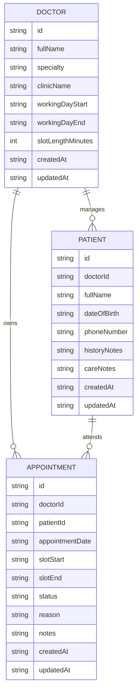

# CalmAnchor Lite Data Model

This schema follows the assessment baseline: one doctor manages five patients and one working day of 20-minute appointments.

## Slot Rules

- Working day starts at `09:00`.
- Working day ends at `17:00`.
- Slot length is `20` minutes.
- Total available slots: `24`.
- A slot is available when no appointment exists with the same `doctorId`, `appointmentDate`, and `slotStart`.
- When changing an appointment, exclude all booked slots except the appointment's current slot.

## Seed Data Target

- 1 doctor.
- 5 patients linked to that doctor.
- Sample appointments across the working day.
- Enough empty slots to prove that rescheduling filters booked slots correctly.

