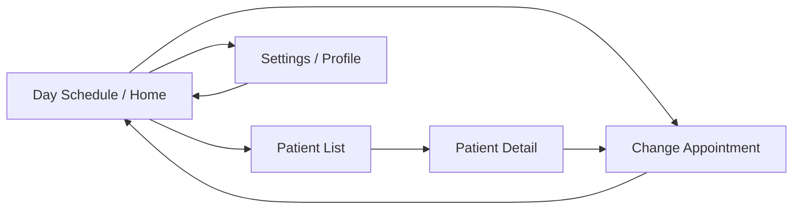

# Screen Map

```mermaid
flowchart LR
    A["Day Schedule / Home"] --> B["Patient List"]
    B --> C["Patient Detail"]
    A --> D["Change Appointment"]
    C --> D
    A --> E["Settings / Profile"]
    D --> A
    E --> A
```

## Required Screens

- Day Schedule / Home
- Patient List
- Patient Detail
- Change Appointment
- Settings / Profile

