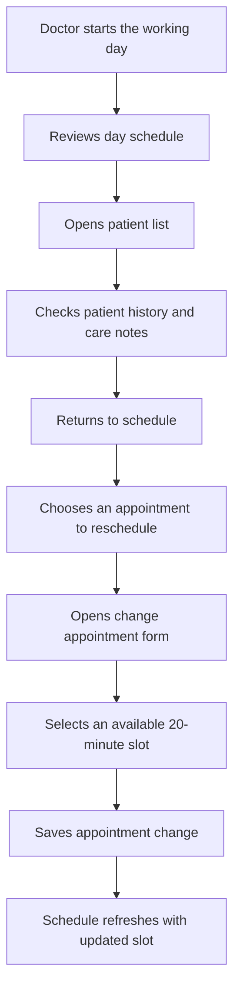

# User Journey

```mermaid
flowchart TD
    A["Doctor starts the working day"] --> B["Reviews day schedule"]
    B --> C["Opens patient list"]
    C --> D["Checks patient history and care notes"]
    D --> E["Returns to schedule"]
    E --> F["Chooses an appointment to reschedule"]
    F --> G["Opens change appointment form"]
    G --> H["Selects an available 20-minute slot"]
    H --> I["Saves appointment change"]
    I --> J["Schedule refreshes with updated slot"]
```

The doctor is the only user. There is no login flow in the baseline assessment scenario.

